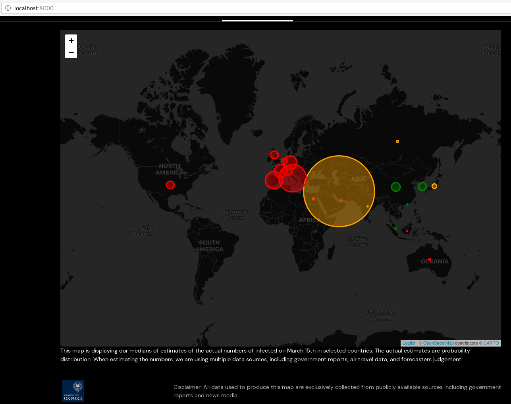

# COVID-19 visualizer

Frontend for http://epidemicforecasting.org/



## Architecture
* `server` - a express.js webserver using nunjucks for templating
* `frontend` - client-side code, written in typescript and bundled by webpack.
* `static` - static resources

# Development
## Using docker (the easiest)
Run
```
docker-compose up 
```
and visit http://localhost:8000.

## Local installation
Requiers `nodejs` and `yarn`. Run
```
yarn install // install dependencies
yarn run dev // start the dev server
```

and visit http://localhost:8000.

## Tests and linting
```
yarn run lint-check // linting - just checking)
yarn run lint-write // linting - updating in place
yarn run test // run tests
```

## Development flow
It's the author responsibility to do the merge, ideally after having it reviewed. That is:

1. run `yarn run lint-write` and do your PR
2. ask for review relevant reviewers
3. as soon as you get :heavy_check_mark: , you can merge
4. if you don't get :heavy_check_mark: before you go to sleep, you can merge anyway (after manual "testing"). It's of course fine to wait for a review when you don't feel confident merging it without one.
5. there are three teams you can add on review: `frontend`, `backend` and `data`

Rather overcommunicate what you are working on.

# Deployment
We use Github Actions. The pipeline is specified in `.github/workflows/pythonapp.yml`

* On a merge to `staging` branch, the code is deployed to the staging environment: http://staging.epidemicforecasting.org/
* On a merge to `master` branch, the code is deployed to the production environment: http://epidemicforecasting.org/

# Using Google Cloud Storage for the web assets
We are using Google Cloud Storage bucket called `static-covid`. To upload things there you need:

1. permissions to upload things there, can be granted to your gmail account by owners of the `GCP` project (@hnykda, @gavento, @laggeros, ...)
2. either use `gsutil`: `gsutil -h "Cache-Control:public, max-age=10" cp -a public-read  <your-file> gs://static-covid/static/`
3. Or go via [browser to the bucket](https://console.cloud.google.com/storage/browser/static-covid?forceOnBucketsSortingFiltering=false&project=epidemics-270907), upload the file via UI and make [them public](https://cloud.google.com/storage/docs/access-control/making-data-public).

You can see in the `gsutil` command that it's setting `Cache-Control`. By default, files are cached under the same name up to 1 hour. So you either want to reduce it to the above (10 seconds) or have to use a different name. Sadly, there is no way to do this via the web console. For that, there is a handy [CI bit here](https://github.com/epidemics/covid/blob/master/.github/workflows/pythonapp.yml#L19-L21) - once a build is triggered (on ANY branch), all files are set to be public and with lower cache. So if you don't wanna mess with gsutil on your machine, just upload the files and trigger a build by random commit.
