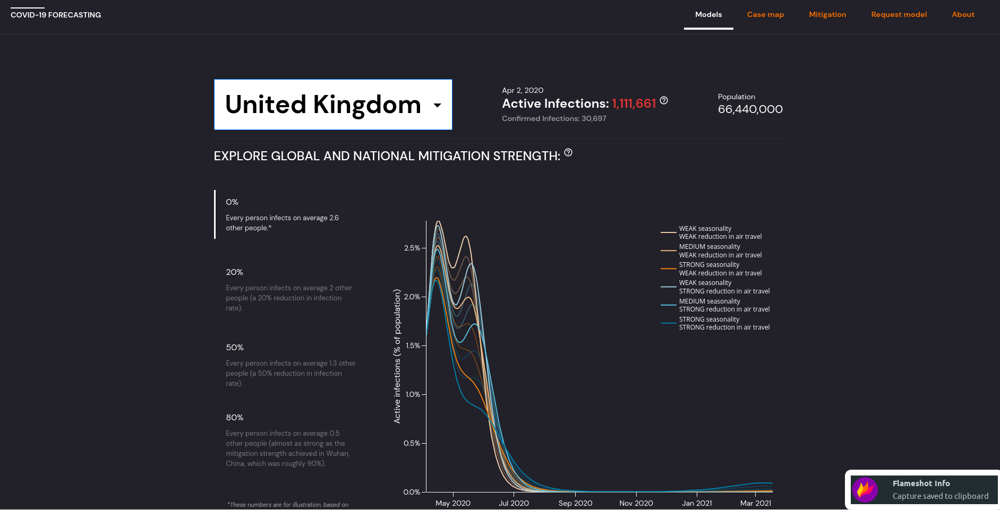

# COVID-19 visualizer

Frontend for http://epidemicforecasting.org/



## Setup & linting

### Using docker (the easiest)

Run

```
docker-compose up
```

visit http://localhost:8000.

### Local installation (recommended)

Requires `nodejs` and `yarn`. Run

```
yarn install // install dependencies
yarn run dev // start the dev server
```

visit http://localhost:8000.

### Tests and linting

```
yarn run lint-check // linting - just checking)
yarn run lint-write // linting - updating in place
yarn run test // run tests
```

There is a git hook for running the linter on pre-commit in `/hooks`.
This can be configured to run every time (for this repository only)
by running `git config core.hooksPath hooks`.

## Architecture & Contributing

For the contribution details and project management, please see [this specification](https://www.notion.so/Development-project-management-476f3c53b0f24171a78146365072d82e).

- `server` - a express.js webserver using nunjucks for templating
- `frontend` - client-side code, written in typescript and bundled by webpack.
- `common` - shared code between the frontend and server
- `common/spec` - contains the data spec which the frontend expects for visualization (see `Channels and visualizations`) below
- `static` - static resources

### Channels and visualizations

The project fetches data and displays data stored in google cloud. We have three different data `channel`s
that get used depending on the context:

- On production at `http://epidemicforecasting.org/` the default `channel` is `main`
- On staging at `http://staging.epidemicforecasting.org/` the default `channel` is `staging`
- Anywhere else like a local development server uses `testing` as the default `channel`

There can be overridden manually by using the url param `?channel=`. The website fetches the corresponding
file at https://storage.googleapis.com/static-covid/static/data-${channel}-v4.json
This file has to conform to our [data format][https://github.com/epidemics/covid/blob/master/common/spec/v4.ts]
so the frontend knows how to visualize it. This data format is formalized as typescript definitions
in `common/spec/v4.ts`. The `epimodel` repository can be used to [generate and upload these files](https://github.com/epidemics/epimodel#running-pipeline-to-get-web-export).
The `channel` corresponds to the `-c` argument of the `epimodel` commmand `./do web_upload`.

In the `frontend` the current `channel` is accessible as a global variable `DEFAULT_EPIFOR_CHANNEL`
(see [`frontend/@types/epifor.d.ts`](https://github.com/epidemics/covid/blob/master/frontend/%40types/epifor.d.ts).

### Development flow
The whole dev project management is [described here](https://www.notion.so/Development-project-management-476f3c53b0f24171a78146365072d82e). What follows below is specific to this repository.

It's the author responsibility to do the merge, ideally after having it reviewed. That is:

1. run `yarn run lint-write` and do your PR
2. ask for review relevant reviewers
3. as soon as you get :heavy_check_mark: , you can merge
4. if you don't get :heavy_check_mark: before you go to sleep, you can merge anyway (after manual "testing"). It's of course fine to wait for a review when you don't feel confident merging it without one.
5. there are three teams you can add on review: `frontend`, `backend` and `data`

Rather overcommunicate what you are working on.

## Deployment

We use Github Actions. The pipeline is specified in `.github/workflows/deploy-web.yml`

You can see in the `gsutil` command that it's setting `Cache-Control`. By default, files are cached under the same name up to 1 hour. So you either want to reduce it to the above (10 seconds) or have to use a different name. Sadly, there is no way to do this via the web console. For that, there is a handy [CI bit here](https://github.com/epidemics/covid/blob/master/.github/workflows/pythonapp.yml#L19-L21) - once a build is triggered (on ANY branch), all files are set to be public and with lower cache. So if you don't wanna mess with gsutil on your machine, just upload the files and trigger a build by random commit.
